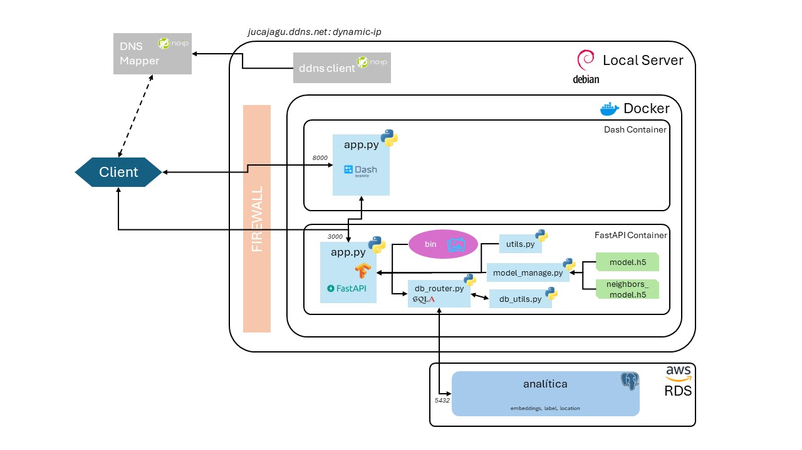

# DataSaurusRex - Proyecto de Clasificación y Similitud de Imágenes Artísticas

- Daniel Pombo
- Juan Camilo Jaramillo
- Santiago Ramírez Castañeda

## Descripción del Proyecto
Este proyecto tiene como objetivo desarrollar un sistema para la clasificación y búsqueda de similitud de imágenes, tanto a través de una API como mediante una interfaz gráfica. Utilizando técnicas avanzadas de machine learning, se logró entrenar un modelo que, además de clasificar las imágenes en categorías, permite identificar las cinco imágenes más similares dentro de una base de datos. Este sistema puede ser útil para automatizar tareas de categorización en el mundo artístico y tiene el potencial de ser ampliado para predecir estilos y escuelas artísticas con más datos y metadatos de las imágenes.

## Reporte Final
El reporte que recopila todo el proyecto con sus características y elementos lo encuentras [aquí](./reports/final_report.md)

## Enlace al Producto
Para revisar el producto final, puedes acceder al siguiente enlace:

[Revisar Producto](http://jucajagu.ddns.net:8000)

*Se recomienda visualizar en un computador ya que en celulares o tablets tiene dificultades para presentación.

## Notebooks de Análisis
El análisis exploratorio y el entrenamiento del modelo se documentaron en los siguientes notebooks:

- [Análisis Exploratorio de Datos](./notebooks/data_exploration_01.ipynb)
- [Entrenamiento del Modelo](./notebooks/model_building_02.ipynb)

## Colección de Datos
Puedes revisar la colección de datos utilizada para el entrenamiento y validación del modelo aquí:

[Colección de Datos](./data_collection/)

## Despliegue del Sistema

La infraestructura del sistema se organizó en varios directorios, incluyendo la configuración del backend y frontend, así como los contenedores Docker. Puedes acceder a estos directorios aquí:

- [Backend (FastAPI)](./deployment/backend/)
- [Frontend (Dash)](./deployment/frontend/)
- [Carga de Datos a RDS](./deployment/db_load/)

## Conclusión
El proyecto fue efectivo al crear un MVP que desde el preprocesamiento de una base de datos mediana y la integración de diversas tecnología permitió la clasificación y similitud de imágenes. Este sistema no solo ha demostrado su viabilidad técnica, sino que también establece una base sólida para futuras mejoras y aplicaciones en diversos ámbitos en la clasificación de imágenes artísticas.