# 1. Marco Teórico
## Uso, procesamiento y clasificación de imágenes
Una imagen en un plano bidimensional se puede definir como una función de dos variables, un ejemplo de esto podría ser $a(x,y)$ siendo $a$ el brillo de una imagen en la coordenada $(x,y)$, el caso de una imagen digital no es fundamentalmente diferente ya que esta se divide en $N$ filas y $M$ columnas, donde sus intersección es definida como un pixel [@Young1995].  

Una de las variables que considera la función de una imagen es el color o longitud de onda ($\lambda$), esta es percibida por los seres humanos gracias los tres pigmentos de colores que se encuentran en la retina (Young et al., 1995). En imágenes digitales, su representacion se da de una manera similar en términos de las combinaciones de colores primarios -generalmente siendo rojo, verde y azul- donde cada canal representa la intensidad del respectivo color entre 0 y 255. En otras palabras, cada imagen en RGB está realmente compuestas por 3 imágenes.

Por otro lado, la clasificación de imágenes es un proceso que busca que la maquina pueda "leer" una nueva información que recibe en forma de imagen y mediante un proceso de entrenamiento previo pueda clasificarla en una determinada clase [@Ponnusamy2017], para el caso de aprendizaje supervisado, las clases de un set de entrenamiento son dadas inicialmente a la máquina [@Raut2023].  
Este proceso de clasificación de imágenes ha sido abordado desde las redes neuronales convolucionales en los años 90 [@LeCun1989], encontrando altos indicadores del desempeño de estas [@Zeiler2014]. El funcionamiento fundamental de estas parte por un mapeo de imagen 2D $x_i$ por una serie de capas a un vector de probabilidad $\hat{y_i}$ para todas las posibles clases, siendo la capa final un clasificador de tipo "softmax" [@Zeiler2014].

## Antecedentes

Un ejemplo de estas aplicaciones puede verse en el mundo del comic, donde las redes neuronales han sido identificadas en un estudio sistematico como la segunda estrategia de vision computacional más comun para analizar e interpretar los datos [@Sharma2024]  

# 2. Contexto y Objetivo del Proyecto
## Objetivo de clasificar imágenes relacionadas a elementos artísticos
El objetivo principal de este proyecto es desarrollar un modelo capaz de clasificar imágenes con obras artísticas. Este sistema utilizará técnicas avanzadas de aprendizaje automático, específicamente redes neuronales convolucionales, para identificar y categorizar diversos tipos de obras de arte, incluyendo pinturas, esculturas, iconografías, grabados y dibujos. La clasificación precisa y eficiente de estas imágenes no solo facilitará la organización a grandes bases de datos de arte, sino que también permitirá nuevas formas de análisis y estudio de las obras artísticas desde una perspectiva de la vision computacional.

## Justificación y uso para la clasificación automatizada de piezas artísticas, casos de uso
La automatización de este proceso no solo aumentará la eficiencia del mismo, sino que también permitirá manejar volúmenes mucho mayores de información, algo especialmente útil en la era digital. Además, la clasificación automatizada puede abrir nuevas vías para la investigación académica y el estudio del arte. Por ejemplo, puede facilitar el análisis comparativo entre diferentes periodos o estilos, así como la identificación de patrones y tendencias que podrían no ser evidentes mediante el análisis manual.  

# 3. Colección de Datos 
## Descripción de dónde salieron los datos y qué contienen

La información proviene de: [Kaggle](https://www.kaggle.com/datasets/thedownhill/art-images-drawings-painting-sculpture-engraving). Como indica su documntación, la base original cuenta con 12.800 imágenes provenientes de google images, yandex images y el "Virtual Russian Museum [VRM]", esta tenía un tamaño de apróximadamente 600 mb.

| Formato  | Cantidad |
|----------|----------|
| .jpg     | 7,583    |
| .jpeg    | 5,145    |
| .png     | 56       |

Esta viene distribuida en dos carpetas con información separada "dataset" y "musemart" cada una con un respectivo "training_set" y "validation_set", no se reportó una razón para esta separación inicial en "dataset" y "musemart" y por eso esta fue integrada inicialmente en dos únicas carpetas "training_set" y "validation_set".

# 4. Análisis Exploratorio
## Highlights y procedimiento de EDA con hallazgos

Como parte de la extracción inicial de las imágenes en el training_set, se identificaron 108 que no pudieron ser procesadas por errores en formato, y al revisar la conversión de estas en arrays se encontraron 1567 imágenes duplicadas. Finalmente, tras la limpieza de datos, se procesaron 6621 imágenes correctamente como parte del training set y con la siguiente distribucion de clases:

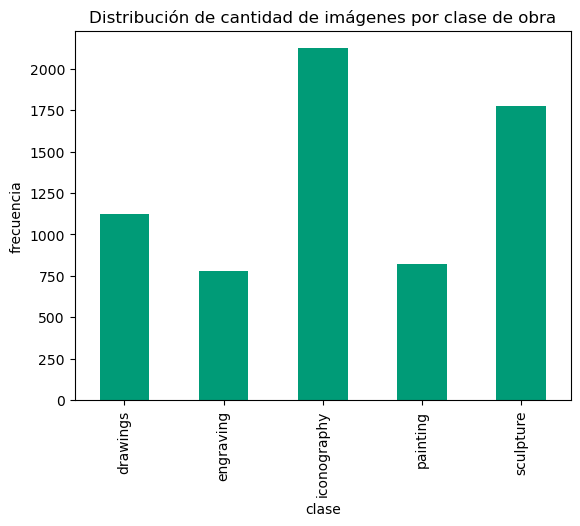{width=50%}

Para el validation_set, 16 imágenes no pudieron ser procesadas por errores en formato, y se encontraron 152 duplicadas, es decir se contó con 955 imágenes para el proceso de validación.

Las imágenes cargadas fueron transformadas a arrays con un shape (150, 150, 3) para que pudieran ser operadas por la RNC. Adicionalmente, se analizaron los histogramas correspondientes para la intensidad promedio de los canales RGB de las clases de imágenes. Estos pueden observarse a continuación:

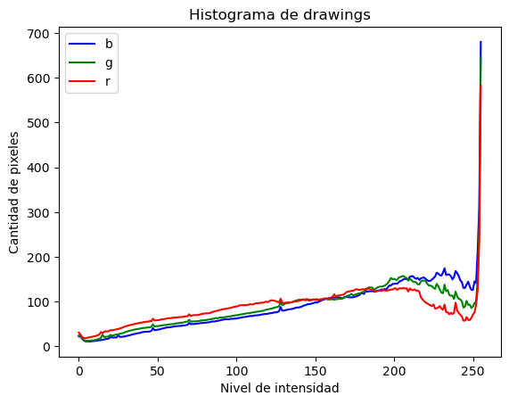{width=50%}
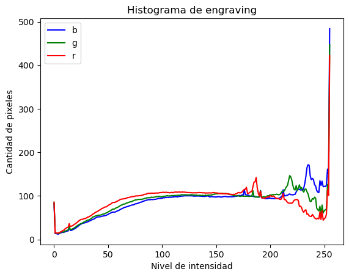{width=50%}
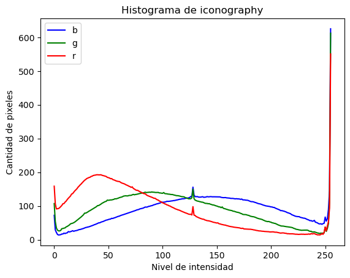{width=50%}
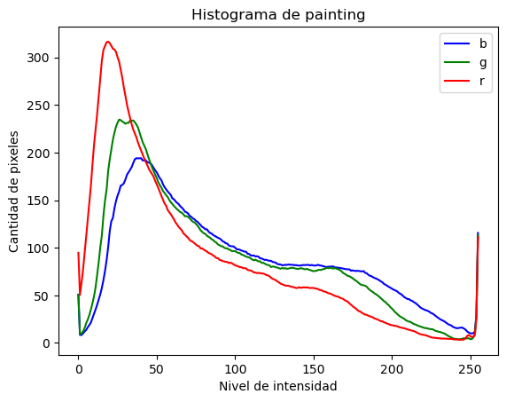{width=50%}
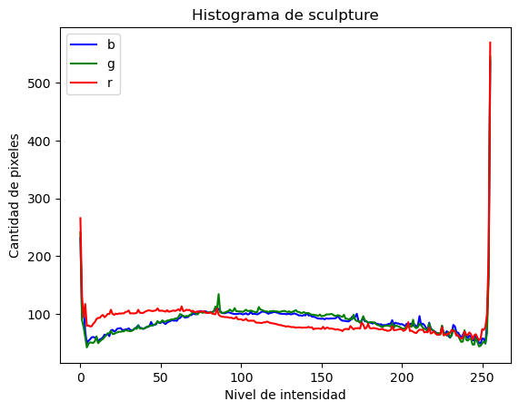{width=50%}

Algunos análisis que se pueden realizar de estos es la similitud entre los histogramas de dibujos y grabados que puede entenderse dado que estos se caracterizan por ser imágenes en escala de grises. Por otro lado, la mayor diferencia en la distribución de pixeles entre canales de color puede verse en las iconografías, esto se explica dada que en estas imágenes se pueden observar el uso de colores con un alto contraste entre sí en la creación y diseño de las mismas.

También se puede notar los picos en las zonas claras de intensidad de la imagen, esto se identificó que es debido a las imágenes que originalmente venían con "bordes" en blanco a su alrededor, se asume que estas originalmente correspondían a imagenes tipo .png que fueron transformadas a .jpg asignándoles este color blanco a los pixeles que no se registraban. 

## 5. Modelo de Clasificación
## Explicación de Modelo Neuronal
Congruente con el objetivo de desarrollar un modelo de clasificación de imágenes con obras artísticas dependiendo de su tipología, se manejo un modelo de red neuronal con una arquitectura similar a la de AlexNet [@Krizhevsky2012]. Para este proyecto en particular se utilizo una arquitectura con múltiples capas de neuronas convolucionales seguidas de capas densas funciones de activación ReLU para maximizar el desempeño de la captura de los pesos particulares de los modelos. Adicionalmente se utilizó un optimizador Adam congruente con el objetivo de minimizar el costo computacional de la convergencia del algoritmo. En la siguiente tabla se visualiza las especificidades de las capas usadas

| Capa                        | Tipo                      | Filtros/Unidades | Tamaño de Kernel | Función de Activación |
|------------------------------|---------------------------|---------------|-----------------------|------------|
| `inputs`                     | Input                     | -             | -                     | -          |
| `conv2d_3`                   | Conv2D                    | 16            | (3, 3)                | ReLU       |
| `max_pooling2d_3`            | MaxPooling2D              | -             | (2, 2)                | -          |
| `conv2d_4`                   | Conv2D                    | 32            | (3, 3)                | ReLU       |
| `max_pooling2d_4`            | MaxPooling2D              | -             | (2, 2)                | -          |
| `conv2d_5`                   | Conv2D                    | 64            | (3, 3)                | ReLU       |
| `max_pooling2d_5`            | MaxPooling2D              | -             | (2, 2)                | -          |
| `conv2d_6`                   | Conv2D                    | 128           | (3, 3)                | ReLU       |
| `max_pooling2d_6`            | MaxPooling2D              | -             | (2, 2)                | -          |
| `conv2d_7`                   | Conv2D                    | 256           | (3, 3)                | ReLU       |
| `max_pooling2d_7`            | MaxPooling2D              | -             | (2, 2)                | -          |
| `global_average_pooling2d_1` | GlobalAveragePooling2D    | -             | -                     | -          |
| `dense_8`                    | Dense                     | 128           | -                     | ReLU       |
| `dense_9`                    | Dense                     | 128           | -                     | ReLU       |
| `dense_10`                   | Dense                     | 128           | -                     | ReLU       |
| `dense_11`                   | Dense                     | 128           | -                     | Linear     |
| `dense_12`                   | Dense                     | 5             | -                     | Softmax    |

Es importante aclarar que la penúltima capa K[-2] se escogió con una activación lineal para desarrollar un pseudo-embedding que permitiera asociar la similitud de las imágenes. Para mayor detalle de este proceso véase el apartado [Embedding de imágenes](#embedding-de-imágenes)

A esta arquitectura se llego desde un proceso iterativo utilizando el set de entrenamiento con procedimiento de ``cross validation`` para identificar el modelo que maximizara la métrica de accuracy para los datos sobre los que no se entrenaba evitando generar un sobre-entrenamiento del modelo. Cabe destacar que en dicho proceso iterativo se utilizaron redes neuronales ya entrenadas en distintos tipos de imágenes, sin embargo al momento de hacer el fine-tuning con las imágenes y clases a predecir se generaba un alto nivel de sobre-entrenamiento, elemento por lo cual se desestimo dicha aproximación de basarse en un modelo ya entrenado para la tarea.

Cómo se evidencia en la figura a continuación construida con 5 Folds de ``cross validation`` entrenando la red a 30 épocas. El modelo empezaba a presentar un comportamiento de sobre-entrenamiento e incremento de la función de perdida desde la época 9-10. Por ello se decidió entrenar el modelo hasta las 10ma época.

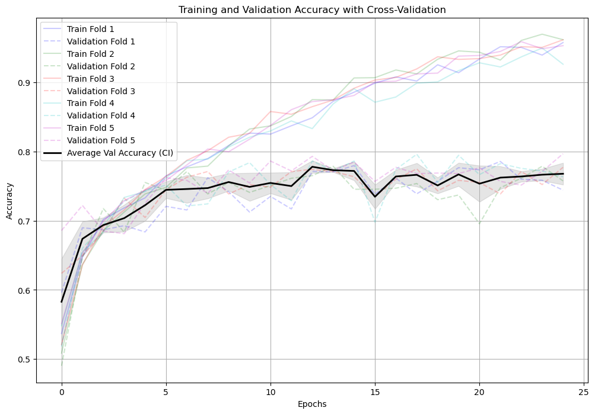{width=50%}
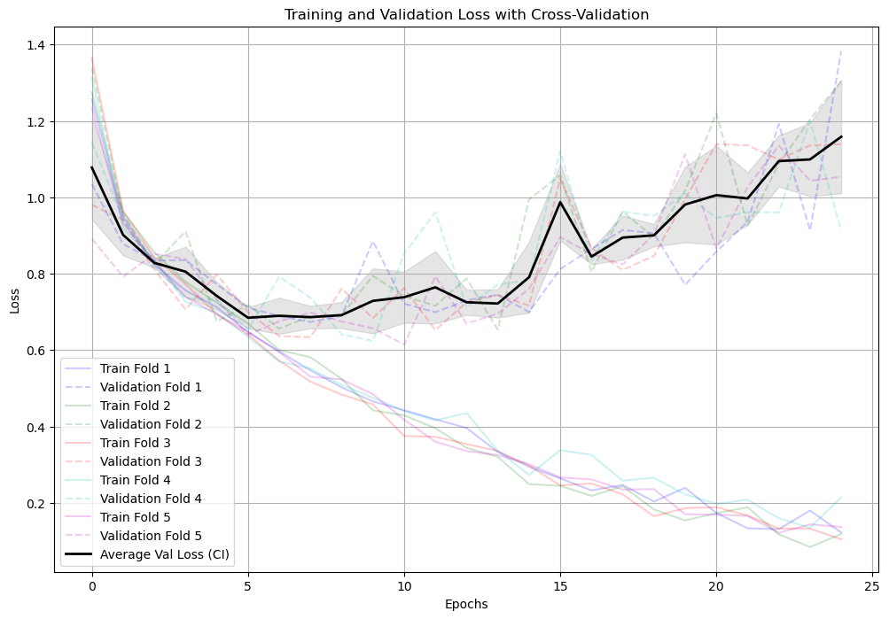{width=50%}

Entrenado el modelo con su corrección de hiper-parametros y entrenamiento se procedió a la calificación con el set de validación (la carpeta de ``validation_set`` que hasta el momento no había sido utilizada para ningún proceso). Ello evidencio que el modelo entrenado en su finalidad evidenciaba el siguiente resultado:

| Métrica | Indicador |
----------|-------------
| Accuracy| 0.79      |
| Loss    | 0.52      |

Considerando que la clase con mayor cantidad de elementos de los datos representaba el 28% del total (pinturas). Y por otra parte que que el predecir aleatoriamente sobre 5 clases correspondería a una probabilidad de acierto del 20%. Este modelo logra capturar una capacidad predictiva superior al factor aleatorio o modelo base (de predecir todo como pinturas) de entre un 51%-59% mejor accuracy.

Esto significa que se logró desarrollar un modelo de clasificación suficientemente adecuado que logra capturar una buena parte de los elementos representativos que constituyen diversas categorías de imágenes dentro de la colección de datos obtenida.

Para mayor detalle del entrenamiento véase [este](../notebooks/model_building_02.ipynb) notebook.

## Visualización 3D 
En el proceso de análisis de interpretación del modelo, sobre el modelo entrenado se añadió una capa de 3 neuronas con una función de activación lineal antes de la capa de salida con el objetivo de extraer un embedding que permitiera ver visualmente y de manera tridimensional la capacidad de separación de las clases por parte del modelo.

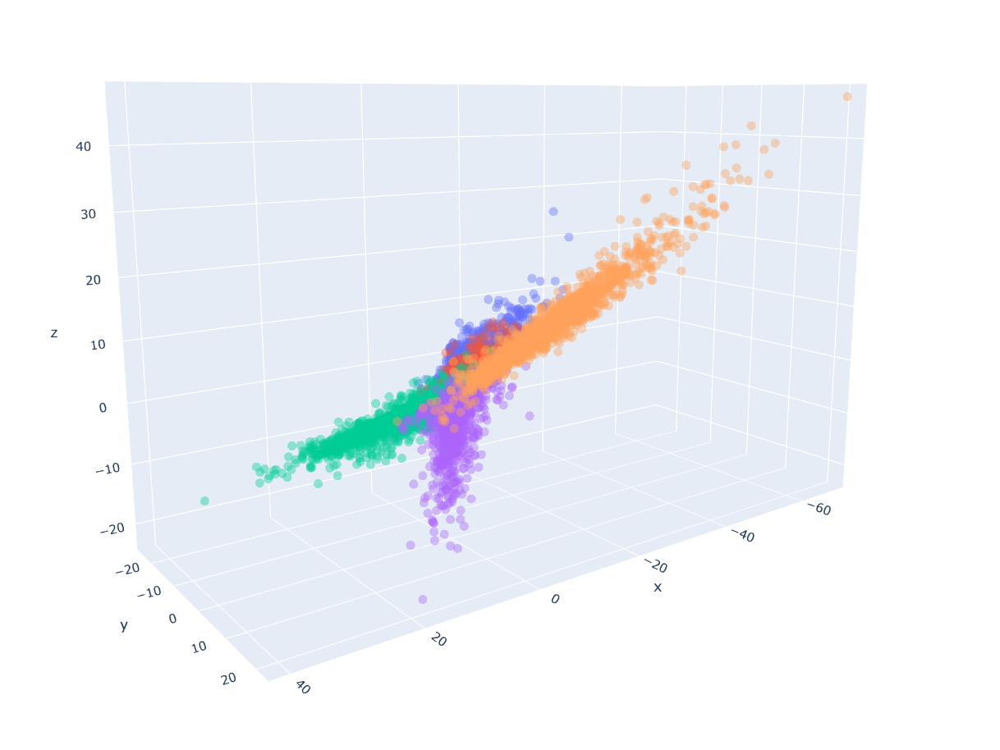

Para interactuar con el gráfico descarga el html [aquí](resources/3d_scatter_plot.html)

Se refleja que existe una buena diferenciación entre lo que se define como esculturas, pinturas e iconografías. Sin embargo se refleja una superposición importante entre los grabados (engravings) con los dibujos, evidenciando que existe una posible dificultad en la separación entre estas dos etiquetas. 

## Embedding de imágenes
Este apartado desarrolla sobre el sub-objetivo que correspondía a identificar, para cada imagen a la que se hacía predicción de su categoría, las 5 imágenes más similares que se encontraban en la base de datos desde el modelo computacional entrenado.

La penúltima capa del modelo es una capa de 128 neuronas con una activación lineal, sobre la cual se creó una subred para predecir y extraer el resultado de esa capa. De ello, se creó una base de datos que tenía las siguientes columnas: label y location (ubicación del archivo). Esta información fue cargada a la base de datos de RDS para crear una similitud basada en distancia de coseno, permitiendo encontrar las 5 imágenes de la misma clase con atributos similares desde lo entrenado del modelo.

embedding_images.csv
Descripción: Este archivo CSV contiene los embeddings producidos por la salida de un modelo de red neuronal.
Detalles:
Los embeddings consisten en 128 campos, representando la similitud de las imágenes en un espacio hiperdimensional.
Incluye una columna para el nombre de la ubicación del archivo en el bucket de data lake del servidor que hostearía el sistema de clasificación. También contiene una columna para la etiqueta que indica el tipo de imagen (por ejemplo, pintura, escultura).

Para llevar a cabo esta tarea, se siguió el siguiente proceso:

### Extracción de Embeddings:

Se tomó la penúltima capa del modelo neural, que tiene 128 neuronas con activación lineal, como la representación embebida (embedding) de las imágenes.
Una subred fue extraída del modelo central para obtener estos embeddings y almacenarlos junto con la etiqueta y la ubicación del archivo en un CSV.

### Creación de la Base de Datos:
El archivo embedding_images.csv fue cargado a una base de datos RDS.
La base de datos se estructuró para permitir búsquedas eficientes basadas en la distancia de coseno entre los embeddings.

### Búsqueda de Imágenes Similares:
Utilizando la distancia de coseno (típicamente usado en el calculo de distancia entre embeddings), se calcularía la similitud entre los embeddings de la base de datos con la imagen entrante a predecir.
Ello permite que para cada imagen de entrada, se identificaran las 5 imágenes más similares en términos de sus embeddings.
Estas similitudes permitieron identificar imágenes con atributos visuales similares dentro de la misma categoría.

### Resultados
La implementación de este proceso permite al sistema no solo predecir la categoría de una imagen, sino también encontrar imágenes visualmente similares, facilitando la exploración y el análisis de grandes bases de datos de imágenes.

Este enfoque basado en embeddings y similitud de coseno demuestra cómo los modelos de redes neuronales pueden ser utilizados no solo para clasificación, sino también para tareas de búsqueda y recuperación de información en grandes conjuntos de datos visuales.

# 6. Carga de Datos
## Explicación de RDS Amazon y su uso

Amazon Relational Database Service (RDS) es un servicio en la nube administrado que facilita la configuración, la operación y la escalabilidad de bases de datos relacionales. (https://aws.amazon.com/rds/).  Para el desarrollo del proyecto la base de datos ("ANALITICA") cuenta con información de datos analíticos como embeddings, etiquetas (label) y ubicaciones (location).

**Embeddings:** Los embeddings son representaciones vectoriales de datos que capturan relaciones y similitudes semánticas. Es este caso cada fotografia tiene su representación.

**Etiquetas:** Las etiquetas son metadatos que se asocian con datos para proporcionar información adicional. Para el proyecto tenemos etiquetas para identificar si la fotografía corresponde a un dibujo (drawings), escultura (sculptures), etc.

**Ubicaciones:** Las ubicaciones son datos que representan la ubicación del archivo fotográfico dentro del servidor en la carpeta /bin/* de acuerdo a la similitud encontrada por el modelo.   

La siguiente es la estructura de la BD utilizada en la arquitectura del proyecto.

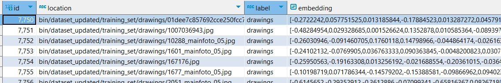

La base de datos es POSTGRES la cual fue configurada directamente en la interfaz de AWS y garantizando su acceso publico (analitica.cakbsuyk0vne.us-east-1.rds.amazonaws.com)

## Carga de embeddings de imágenes
Utilizando un [script](../deployment/db_load/) de python basado en psycopg2 se cargo el csv obtenido de extraer todos los embeddings de las imágenes de la base de datos, cómo se explica en la sección de [Embedding de Imagenes](#embedding-de-imágenes). 

# 7. Infraestructura y Despliegue
## Diagrama y explicación de procesamiento
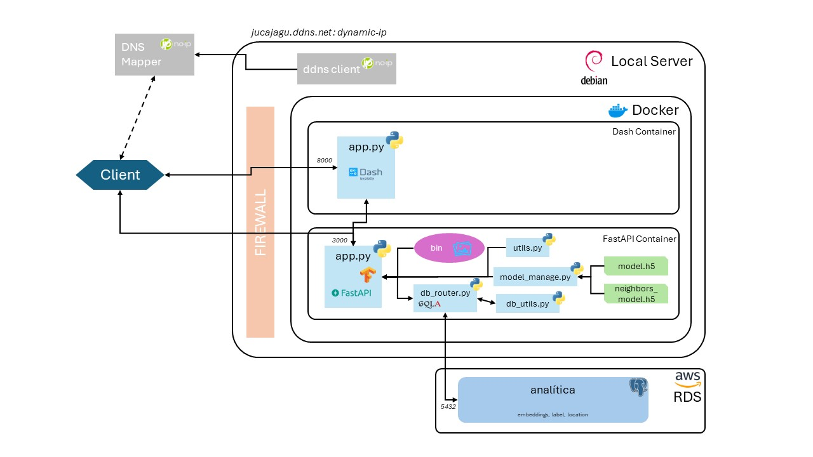
Esta infraestructura se compone de varios componentes clave que se comunican entre sí para proporcionar servicios a los clientes. A continuación, se describe cada uno de estos componentes y su función:

Cliente: El usuario final que se conecta a la infraestructura a través de Internet ya sea usando la interfaz de dash por medio del puerto 8000 como directamente al endpoint de la API desde el puerto 3000.

Servidor Local (Debian): Es el servidor principal que ejecuta el sistema operativo Debian. Este servidor está conectado a Internet y es accesible a través de una dirección IP dinámica gestionada por un cliente DDNS.

DDNS Client: Gestiona la dirección IP dinámica del servidor local, permitiendo que el servidor sea accesible a través de un nombre de dominio (jucajagu.ddns.net).

Docker: Se utiliza para ejecutar contenedores que encapsulan las aplicaciones y sus dependencias. Hay dos contenedores principales en este sistema:

- Contenedor Dash:
    - app.py (Dash): Este contenedor ejecuta una aplicación Dash en el puerto 8000. Dash es un marco de Python para construir 
aplicaciones web analíticas.

- Contenedor FastAPI:
    - app.py (FastAPI): Este contenedor ejecuta una aplicación FastAPI en el puerto 3000. FastAPI es un marco web rápido (high-performance) para construir APIs con Python.
    - model_manage.py: Gestiona los modelos de machine learning.
    - db_router.py: Se encarga del enrutamiento de la base de datos utilizando SQLAlchemy.
    - db_utils.py: Proporciona utilidades para la gestión de la base de datos.
    - utils.py: Proporciona utilidades para cálculos y preprocesamientos de la API.
    - model.h5: Archivo de modelo principal.
    - neighbors_model.h5: Archivo del modelo que permite predecir el embedding para identificar imágenes más cercanas .

AWS RDS: Base de datos en la nube proporcionada por Amazon Web Services (AWS) utilizando Amazon RDS (Relational Database Service). La base de datos contiene datos analíticos como embeddings, etiquetas (label) y ubicaciones (location).

Firewall: Usando el controlador de UFW regula y filtra el tráfico entre el cliente y los componentes del servidor para proteger la infraestructura.

### Flujo de Datos
El cliente se conecta a través de Internet utilizando el nombre de dominio gestionado por DDNS.
La solicitud pasa a través del firewall y llega al servidor local.
Dependiendo del puerto, la solicitud se dirige al contenedor correspondiente (Dash en el puerto 8000 o FastAPI en el puerto 3000).
La aplicación FastAPI puede interactuar con la base de datos alojada en AWS RDS para recuperar o almacenar datos.
Los modelos de machine learning gestionados por model_manage.py pueden ser utilizados para realizar predicciones o análisis adicionales.

## Backend usando FastAPI
La API del Backend es una interfaz de programación de aplicaciones (API) desarrollada utilizando FastAPI, un marco web de Python para construir APIs de alto rendimiento y escalables. Esta API está diseñada para procesar imágenes y generar predicciones sobre su contenido utilizando modelos de aprendizaje automático.

### Endpoints expuestos
/predict/: Este endpoint permite a los usuarios enviar imágenes para su procesamiento y obtener predicciones sobre su contenido. Requiere autenticación utilizando un token de seguridad para acceder.
Seguridad:

La seguridad en esta API se implementa utilizando un esquema de autenticación de tipo Bearer. Los usuarios deben proporcionar un token de acceso válido en la cabecera de sus solicitudes para acceder a los recursos protegidos. Si el token es inválido o está ausente, se devuelve un código de estado HTTP 401 Unauthorized.

### Método de procesamiento
Cuando se realiza una solicitud al endpoint /predict/, el backend procesa la imagen recibida utilizando un modelo de aprendizaje automático previamente entrenado. Primero, la imagen se transforma en un formato adecuado para el modelo utilizando funciones definidas en el módulo utils. Luego, se hace una predicción sobre el contenido de la imagen utilizando el modelo principal. La predicción se procesa para obtener la etiqueta predicha y la probabilidad asociada. Además, se utiliza otro modelo llamado "neighbor_model" para generar un embedding de la imagen, que luego se utiliza para encontrar los vecinos más cercanos en una base de datos.

### Payload enviado
El payload enviado al endpoint /predict/ consiste en una imagen que se envía como un archivo adjunto en la solicitud POST. La imagen se procesa y se devuelve una respuesta JSON que incluye la etiqueta predicha y la probabilidad asociada, así como una lista de los vecinos más cercanos encontrados en la base de datos, representados como archivos codificados en base64 junto con sus etiquetas y posiciones.

### Auxiliares
La api está orquestrada por el script [app.py](../deployment/backend/src/app.py) la cuál a su vez se contiene funciones auxiliares para las sentencias usando sqlalchemy a la base de datos RDS que contiene los embeddings para identificar las 5 imágenes más cercanas de la enviada al endpoint. A su vez utiliza otros scripts para el preprocesamiento de la imagen y activar el modelo desde el archivo ``.h5``.

## Frontend usando Dash

El desarrollo de la interfaz con la que el usuario final interactua con la plataforma esta desarrollado utilizando la biblioteca DASH. 

Dash proporciona una variedad de componentes integrados que se pueden utilizar para crear aplicaciones web. Estos componentes incluyen:  
**Gráficos:** Dash incluye una variedad de componentes de gráficos que se pueden usar para visualizar datos.  
**Controles de entrada:** Dash incluye una variedad de controles de entrada que se pueden utilizar para recopilar datos de los usuarios. En el caso del proyecto, permite cargar la imagen una vez ésta sea escogida por el usuario.  
**Diseños de página:** Dash incluye una variedad de diseños de página que se pueden usar para organizar los componentes en la pantalla.  La interfaz del proyecto es sencilla permitiendo que el usuario interactue de forma eficiente recibiendo los resultados del analisis rapidamente.

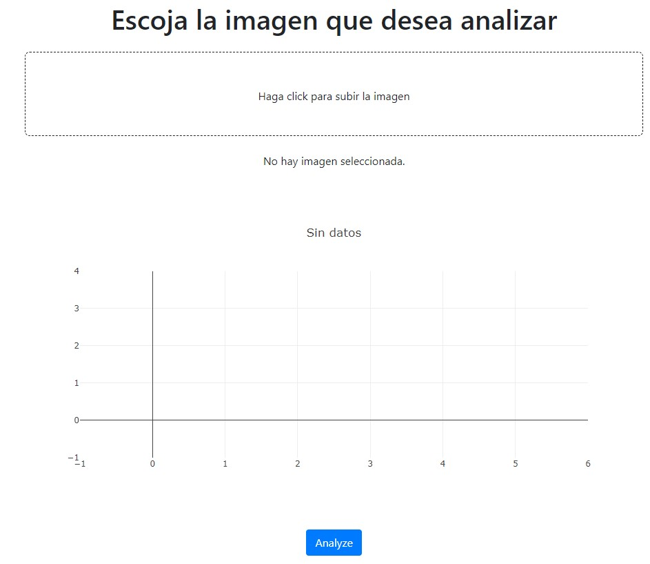

# 8. Solución / Herramientas

## Demo
La siguiente es la URL que permite ingresar a la interfaz de usuario de la aplicación web:  

**- http://jucajagu.ddns.net:8000**  

El siguiente video muestra un demo de la solución:

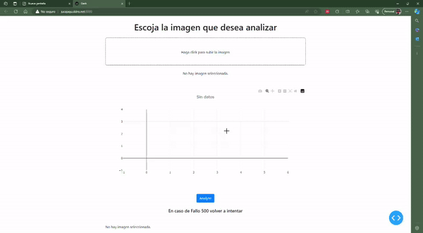

## Pruebas Unitarias
Las pruebas unitarias son un tipo de prueba de software que se utiliza para verificar el comportamiento de unidades individuales de código, como funciones, clases o módulos. Estas pruebas se aíslan del resto del código, lo que permite probarlas de forma independiente y garantizar que funcionan correctamente.  

Durante el desarrollo del proyecto se realizaron diferentes pruebas con cada uno de los componentes de backend y frontend para garantizar la integridad de la solución. Algunas fueron:  
- **Conectividad a la base de datos:**  una vez creada la BD se realizo prueba de conectividad por medio del gestor dbeaver.  
- **Interfaz Dash:** apoyandonos en el aprendizaje obtenido se desarrollo y ajusto la interfaz que permitiera subir archivos dese una carpeta de un PC.  
- **Integración:** teniendo el backend desarrollado, se hizo y se probo la conectividad con el frontend de tal forma que la imagen escogida se lograra analizar.  
- **Publicación:** Por ultimo, al garantizar que los componentes de la aplicación estaban funcionando, se procedió a publicar la url de acceso en internet y realizar analisis desde diferentes computadores.  

Cada una de las pruebas permitio identificar y corregir errores hasta lograr tener todo integrado en la aplicación.

## Explicación de uso

A continuación se describe el paso a paso del uso de la solución:

1. Ingresar a la url **- http://jucajagu.ddns.net:8000**

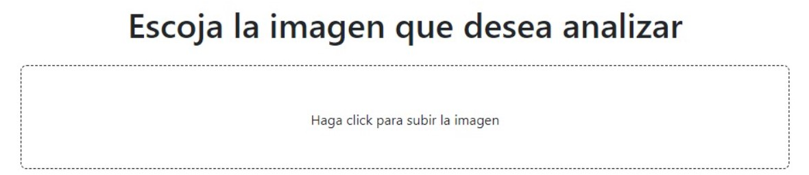

2. Sobre el cuadro enmarcado, haga click para subir una imagen, busque la imagen y presione open.  La imagen sera cargada en la interfaz y desplegará el mapa de frecuencias RGB de acuerdo a las capas identificadas en la fotografía.

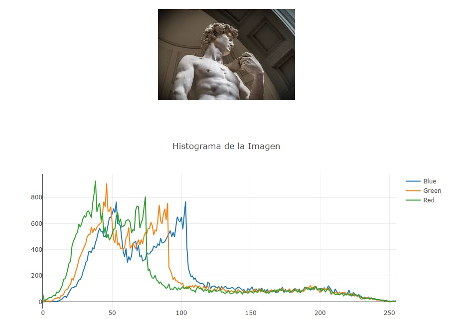

3. Presione el boton **"Analyze"**, esto permitirá que el archivo cargado sea analizado por medio del modelo entrenado y envie el resultado.  

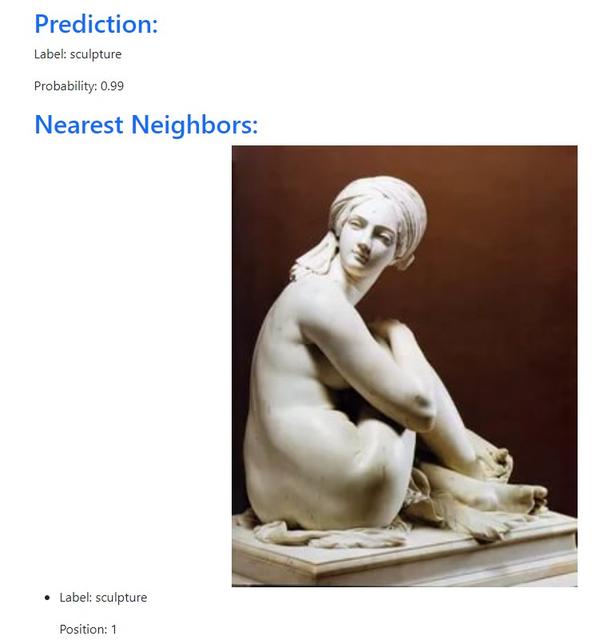

4. En este caso el resultado es la identificación de una **escultura con el 99% de probabilidad**, abajo muestra las 5 fotos que mas se acercan a este resultado.

Para analizar una nueva fotografía se repite el proceso.
   

# 9. Discusión y Conclusiones
El proyecto fue efectivo, logrando crear un sistema y un Producto Mínimo Viable (MVP) para la clasificación de imágenes tanto vía API como con interfaz gráfica. Este sistema, además de integrar distintas tecnologías después de un preprocesamiento de los datos, dar la categoría de las imágenes, permite identificar las cinco imágenes más similares dentro de la base de datos. Este avance puede ser extremadamente útil para automatizar tareas de categorización dentro de operaciones del mundo artístico. Además, se podría extender a otros ámbitos donde, con más datos y metadatos de las imágenes, se podría predecir la escuela de vanguardia o el estilo artístico, entre otros.

Los resultados obtenidos en el análisis exploratorio nos permitieron visualizar algunas de las diferencias que existen entre las distribuciones de intensidad por canal de colores para cada clase de imagen. Basándonos en dicho análisis y utilizando una arquitectura convolucional, se logró entrenar un modelo de clasificación de categorías de imágenes que, de manera adecuada, permitió predecir su tipología. Al analizar este modelo en mayor detalle, se observaron ciertas características donde algunas tipologías presentaban mayor dificultad de separación que otras. A partir de este modelo entrenado y optimizado, se extrajeron embeddings para identificar similitudes entre imágenes.

El sistema se desplegó utilizando un servidor local, con un backend construido con FastAPI y un frontend con Dash, todo encapsulado dentro de contenedores Docker. Para almacenar los embeddings se utilizó un RDS de AWS, con el objetivo de distribuir la carga computacional entre la predicción y la búsqueda de similitudes en el motor de la base de datos. El despliegue se realizó abriendo puertos hacia un dominio gestionado por DDNS.

En resumen, este proyecto no solo ha demostrado la viabilidad de la clasificación y similitud de imágenes mediante técnicas avanzadas de machine learning, sino que también ha creado una base sólida para futuras mejoras y aplicaciones en el ámbito artístico y más allá.

# 10. Limitaciones
- Al las imágenes pertenecer en una gran parte a un banco de imágenes de arte ruso con un sesgo importante de estilo religioso, el modelo puede no tener el mejor desempeño para generalizar los resultados otros tipos de arte como moderno o abstracto.
- El despliegue en un servidor local tiene dificultades al momento de la escalabilidad si se presentará un alto nivel de consultas al servidor.
- La tecnología de Dash-FastAPI, si bien son robustas, para un nivel de carga mayor puede que requiera de frameworks más solidos cómo Django o Nest.
- La ausencia de una IP estática y un certificado SSL para la comunicación puede llevar a problemas en la seguridad e integridad de los datos enviados si este sistema recibiera datos sensibles.
- Por cuestiones de limitaciones temporales no se logró hacer una transformación de las imágenes para augmentar la capacidad de generalización del modelo, lo que conlleva a una limitación de entrenamiento del mismo.

# 11. Referencias
